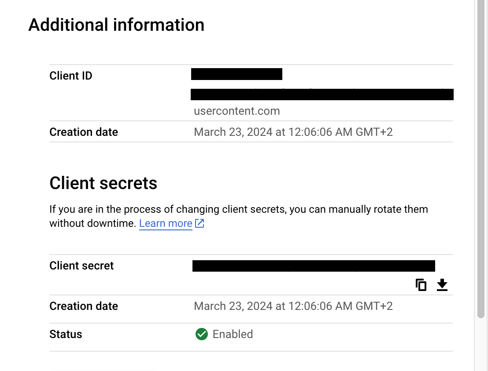

- [Industrial equipment sale application](#industrial-equipment-sale-application)
  - [Environment](#environment)
    - [PostgreSQL with Prisma](#postgresql-with-prisma)
    - [Emailing](#emailing)
    - [NextAuth with Google](#nextauth-with-google)
      - [Google Cloud Api settings](#google-cloud-api-settings)
    - [Google Cloud Storage](#google-cloud-storage)
    - [Google Maps Api](#google-maps-api)

# Industrial equipment sale application

## Environment

```bash
VERCEL_ENV=development|production
```

### PostgreSQL with Prisma

All the environment variables are obtained from the vercel.com instance of PostgreSQL.

```bash
POSTGRES_DATABASE=
POSTGRES_HOST=
POSTGRES_PASSWORD=
POSTGRES_PRISMA_URL=
POSTGRES_URL=
POSTGRES_URL_NON_POOLING=
POSTGRES_USER=
```

### Emailing

Only `Gmail` is supported at the moment.

```bash
  EMAIL_TO= # Email to send the emails to
  EMAIL_USERNAME = # Email username from which the emails are sent
  EMAIL_PASSWORD = # Email password
```

### NextAuth with Google

Official docs: https://next-auth.js.org/providers/google

```bash
NEXTAUTH_URL=
NEXTAUTH_SECRET=

GOOGLE_CLIENT_ID=
GOOGLE_CLIENT_SECRET=
```

#### Google Cloud Api settings

Authorized redirect URIs:

- local development example: `http://localhost:3000/api/auth/callback/google`
- production example: `https://all-inclusive-srl.vercel.app/api/auth/callback/google`
- for oauth playground: `https://developers.google.com/oauthplayground`

Client ID and Secret are obtained from the Google Cloud Console:



### Google Cloud Storage

Create a new project in the Google Cloud Console

```bash
GOOGLE_CLOUD_PROJECT_ID=
GOOGLE_CLOUD_CLIENT_EMAIL= #generated by Google Cloud
GOOGLE_CLOUD_PRIVATE_KEY= #add "\n" for new lines
GOOGLE_CLOUD_BUCKET_NAME=
```

### Google Maps Api

Enable the Google Maps JavaScript API and the Geocoding API in the Google Cloud Console and create a new API key.

```bash
GOOGLE_MAPS_API_KEY=
```
